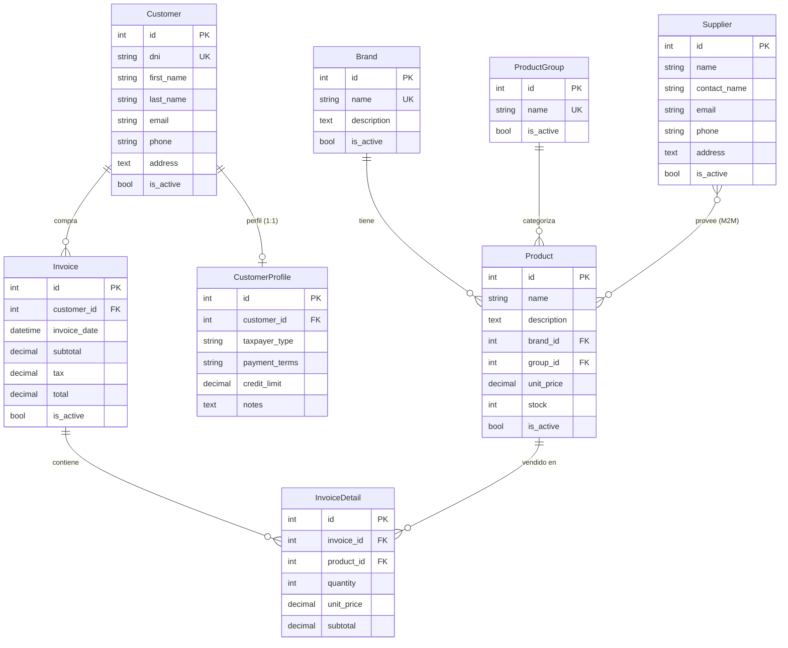

# 🧾 Sales & Billing System (Sistema de Ventas y Facturación)

Sistema web de gestión de ventas y facturación construido con **Django 6.0** y **Python 3.14**. Permite administrar marcas, productos, proveedores, clientes y generar facturas con cálculo automático de IVA (15%).

---

## 📋 Tabla de Contenidos

- [Características](#-características)
- [Arquitectura](#-arquitectura)
- [Modelo de Datos](#-modelo-de-datos)
- [Estructura del Proyecto](#-estructura-del-proyecto)
- [Requisitos Previos](#-requisitos-previos)
- [Instalación](#-instalación)
- [Uso](#-uso)
- [Módulos del Sistema](#-módulos-del-sistema)
- [Seguridad](#-seguridad)
- [Tecnologías](#-tecnologías)

---

## ✨ Características

- **Gestión de Marcas** — CRUD completo con vistas basadas en funciones (FBV) y auditoría de acciones.
- **Grupos de Productos** — Categorización de productos mediante vistas basadas en clases (CBV).
- **Proveedores** — Registro de proveedores con relación muchos-a-muchos con productos.
- **Productos** — Catálogo con marca, grupo, precio, stock y proveedores asociados.
- **Clientes** — Registro con validación de cédula/RUC ecuatoriano (algoritmo módulo 10) y perfil extendido (tipo de contribuyente, condiciones de pago, límite de crédito).
- **Facturación** — Creación de facturas con múltiples líneas de detalle (formsets), cálculo automático de subtotales e IVA (15%).
- **Dashboard** — Página principal con resumen de totales, últimas facturas y alertas de bajo stock.
- **Autenticación** — Registro de usuarios, login/logout integrado con `django.contrib.auth`.
- **Autorización por roles** — Eliminación de registros restringida a usuarios staff (`StaffRequiredMixin`).
- **Auditoría** — Decorador `@audit_action` que registra usuario, acción, IP, método HTTP y timestamp.
- **Panel de Administración** — Interfaz admin de Django completamente configurada con inlines, filtros y búsqueda.

---

## 🏗️ Arquitectura

El proyecto sigue el patrón **MVT (Model-View-Template)** de Django con una estructura modular:

```
┌─────────────────────────────────────────────────┐
│                   config/                       │
│          (Settings, URLs raíz, WSGI)            │
├─────────────────────────────────────────────────┤
│                  billing/                       │
│    (App principal: Models, Views, Forms, URLs)  │
├─────────────────────────────────────────────────┤
│                  shared/                        │
│   (Decoradores, Mixins, Validadores reutiliz.)  │
├─────────────────────────────────────────────────┤
│               templates/                        │
│       (Templates globales y por módulo)          │
└─────────────────────────────────────────────────┘
```

### Patrones utilizados

| Patrón | Uso en el proyecto |
|---|---|
| **FBV** (Function-Based Views) | Marcas (CRUD) y Facturas (list, create, detail, delete) |
| **CBV** (Class-Based Views) | Grupos, Proveedores, Productos, Clientes |
| **Formsets** | Líneas de detalle dentro de facturas (`inlineformset_factory`) |
| **Mixins** | `StaffRequiredMixin` para control de acceso |
| **Decoradores** | `@audit_action` para trazabilidad |
| **Validadores** | `validate_cedula_ec` para cédula/RUC ecuatoriano |

---

## 📊 Modelo de Datos



---

## 📁 Estructura del Proyecto

```
Ventas/
├── config/                     # Configuración del proyecto Django
│   ├── settings.py             # Settings (DB, apps, middleware, auth)
│   ├── urls.py                 # URLs raíz (admin, auth, billing)
│   ├── wsgi.py                 # Punto de entrada WSGI
│   └── asgi.py                 # Punto de entrada ASGI
│
├── billing/                    # App principal de facturación
│   ├── models.py               # 8 modelos (Brand → InvoiceDetail)
│   ├── views.py                # Vistas FBV + CBV
│   ├── forms.py                # SignUpForm, BrandForm, InvoiceForm + Formset
│   ├── urls.py                 # 20+ rutas con namespace 'billing'
│   ├── admin.py                # Configuración del admin con inlines
│   ├── templates/
│   │   ├── billing/            # 21 templates (CRUD + dashboard)
│   │   │   ├── base.html       # Template base con Bootstrap
│   │   │   ├── home.html       # Dashboard principal
│   │   │   ├── *_list.html     # Listados
│   │   │   ├── *_form.html     # Formularios de creación/edición
│   │   │   └── *_confirm_delete.html
│   │   └── registration/       # Templates de autenticación
│   │       ├── login.html
│   │       └── signup.html
│   └── migrations/             # Migraciones de la base de datos
│
├── shared/                     # Módulo de utilidades compartidas
│   ├── decorators.py           # @audit_action — logging de acciones
│   ├── mixins.py               # StaffRequiredMixin — control de acceso
│   └── validators.py           # validate_cedula_ec — validación de cédula EC
│
├── templates/                  # Templates globales (vacío)
├── VENTAS/                     # Entorno virtual de Python
├── db.sqlite3                  # Base de datos SQLite
├── manage.py                   # CLI de Django
└── requirements.txt            # Dependencias del proyecto
```

---

## 📋 Requisitos Previos

- **Python** 3.14+
- **pip** (gestor de paquetes de Python)
- **Git** (opcional, para clonar el repositorio)

---

## 🚀 Instalación

### 1. Clonar el repositorio

```bash
git clone https://github.com/CamiloR2109/Sales_A2.git
cd Sales_A2
```

### 2. Crear y activar el entorno virtual

```bash
# Windows
python -m venv VENTAS
VENTAS\Scripts\activate

# Linux / macOS
python3 -m venv VENTAS
source VENTAS/bin/activate
```

### 3. Instalar dependencias

```bash
pip install -r requirements.txt
```

### 4. Aplicar migraciones

```bash
python manage.py migrate
```

### 5. Crear superusuario (para acceso al admin)

```bash
python manage.py createsuperuser
```

### 6. Ejecutar el servidor de desarrollo

```bash
python manage.py runserver
```

Abrir en el navegador: **http://127.0.0.1:8000/**

---

## 💻 Uso

### Rutas principales

| Ruta | Descripción |
|---|---|
| `/` | Dashboard — resumen general del sistema |
| `/brands/` | Listado de marcas |
| `/groups/` | Listado de grupos de productos |
| `/suppliers/` | Listado de proveedores |
| `/products/` | Listado de productos |
| `/customers/` | Listado de clientes |
| `/invoices/` | Listado de facturas |
| `/invoices/create/` | Crear nueva factura con líneas de detalle |
| `/signup/` | Registro de nuevos usuarios |
| `/accounts/login/` | Inicio de sesión |
| `/admin/` | Panel de administración de Django |

### Operaciones CRUD

Cada módulo soporta las operaciones estándar:

- **Listar**: `/<módulo>/`
- **Crear**: `/<módulo>/create/`
- **Editar**: `/<módulo>/<id>/edit/`
- **Eliminar**: `/<módulo>/<id>/delete/` *(requiere permisos de staff)*

---

## 📦 Módulos del Sistema

### 🏷️ Marcas (Brands)
Gestión de marcas de productos con nombre, descripción y estado activo/inactivo. Implementado con **Function-Based Views** y decoradores de auditoría.

### 📂 Grupos de Productos (Product Groups)
Categorización de productos. Implementado con **Class-Based Views** genéricas (`ListView`, `CreateView`, `UpdateView`, `DeleteView`).

### 🚚 Proveedores (Suppliers)
Registro de proveedores con datos de contacto. Relación **ManyToMany** con productos.

### 📦 Productos (Products)
Catálogo de productos con marca (FK), grupo (FK), proveedores (M2M), precio unitario y control de stock. El dashboard alerta sobre productos con stock ≤ 5 unidades.

### 👤 Clientes (Customers)
Registro de clientes con validación de **cédula ecuatoriana** (algoritmo módulo 10 del Registro Civil). Incluye perfil extendido (`CustomerProfile`) con:
- Tipo de contribuyente: Consumidor Final, RUC, RISE
- Condiciones de pago: Contado, 15, 30 o 60 días
- Límite de crédito

### 🧾 Facturas (Invoices)
Creación de facturas con:
- Selección de cliente
- Múltiples líneas de detalle (formsets con 3 filas vacías iniciales)
- Cálculo automático de subtotales por línea
- **IVA 15%** aplicado automáticamente sobre el subtotal
- Vista de detalle con desglose completo

---

## 🔒 Seguridad

| Característica | Implementación |
|---|---|
| **Autenticación** | `@login_required` y `LoginRequiredMixin` en todas las vistas |
| **Autorización** | `StaffRequiredMixin` para operaciones de eliminación |
| **Validación de datos** | Validador personalizado de cédula/RUC ecuatoriano |
| **Protección CSRF** | Middleware de Django habilitado por defecto |
| **Auditoría** | Decorador `@audit_action` registra usuario, acción, IP y timestamp |
| **Contraseñas** | 4 validadores de Django (similitud, longitud mínima, comunes, numéricas) |

> ⚠️ **Nota**: El proyecto usa `SECRET_KEY` hardcodeada y `DEBUG = True`. Antes de desplegar en producción, configurar variables de entorno y desactivar el modo debug.

---

## 🛠️ Tecnologías

| Tecnología | Versión | Uso |
|---|---|---|
| **Python** | 3.14 | Lenguaje de programación |
| **Django** | 6.0.6 | Framework web |
| **SQLite** | 3 | Base de datos (desarrollo) |
| **Bootstrap** | — | Framework CSS (templates) |
| **HTML5** | — | Templates con Django Template Language |

### Dependencias (`requirements.txt`)

```
asgiref==3.11.1
Django==6.0.6
sqlparse==0.5.5
tzdata==2026.2
```

---

## 📄 Licencia

Este proyecto es de uso académico / educativo.

---

<p align="center">
  Desarrollado con ❤️ usando Django 6.0
</p>
