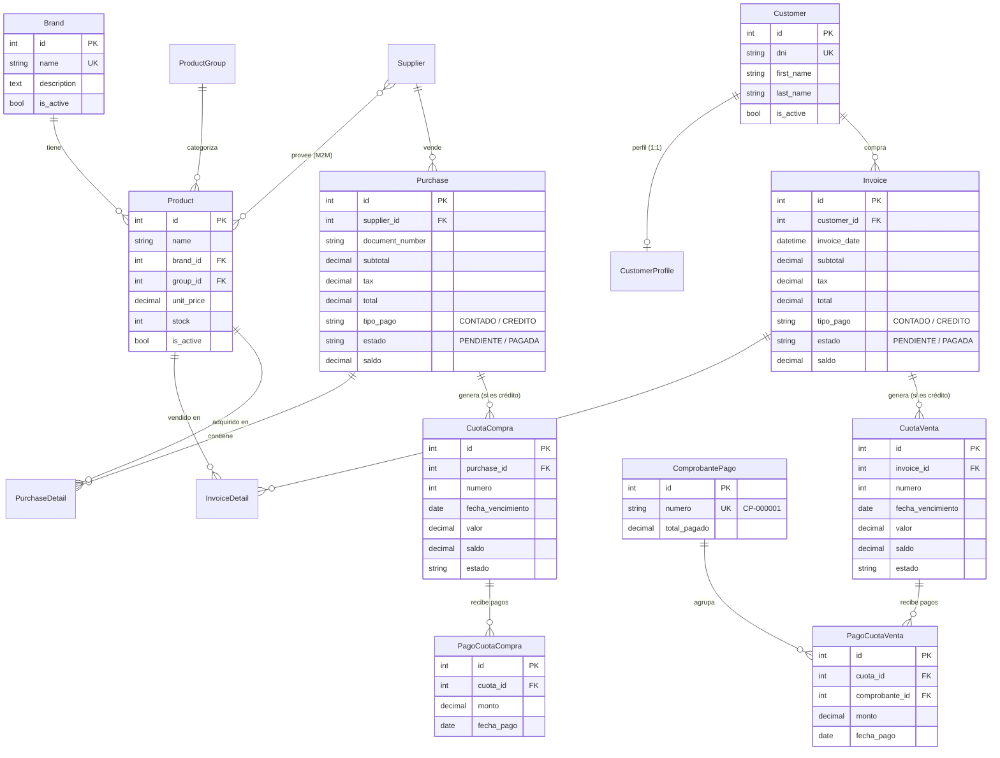

# 🧾 Sales, Billing, Purchasing & Credit System (Sistema de Ventas, Facturación, Compras y Créditos)

Sistema web de gestión integral construido con **Django 6.0** y **Python 3.14**. Permite administrar marcas, productos, proveedores y clientes; generar facturas de venta y comprobantes de compra con pago **al contado o a crédito** (cuotas); gestionar usuarios, roles y permisos; y ofrece una tienda (storefront) para que los clientes hagan pedidos por su cuenta.

---

## 📋 Tabla de Contenidos

- [Características](#-características)
- [Arquitectura](#-arquitectura)
- [Modelo de Datos](#-modelo-de-datos)
- [Estructura del Proyecto](#-estructura-del-proyecto)
- [Requisitos Previos](#-requisitos-previos)
- [Instalación](#-instalación)
- [Uso](#-uso)
- [Módulos del Sistema](#-módulos-del-sistema)
- [Seguridad](#-seguridad)
- [Tecnologías](#-tecnologías)

---

## ✨ Características

- **Gestión de Marcas, Grupos y Proveedores** — CRUD completo (FBV y CBV según el módulo).
- **Productos** — Catálogo con marca, grupo, precio, stock y proveedores asociados.
- **Clientes** — Validación de cédula/RUC ecuatoriano (algoritmo módulo 10) y perfil extendido (tipo de contribuyente, condiciones de pago, límite de crédito).
- **Facturación (Ventas) y Compras** — Formsets de detalle, cálculo automático de subtotales e IVA (15%), y selección de **tipo de pago: Contado o Crédito**.
- **Créditos de Ventas y Compras** — Generación automática de cuotas cuando el pago es a crédito, registro de pagos (individuales o unificados con comprobante), recálculo de saldos y exportación de historial de pagos a PDF.
- **Seguridad y Roles** — Gestión de usuarios, grupos (roles) y permisos por módulo, con pantallas de administración propias (no solo el admin de Django).
- **Tienda (Storefront)** — Catálogo y carrito de compras en sesión para usuarios del grupo `Cliente`, con acceso restringido al resto del sitio mediante middleware.
- **Dashboard** — Resumen de totales, últimas facturas y alertas de bajo stock.
- **Autenticación y Autorización** — Login/logout/registro integrados, roles por grupo (`Administrador`, `Vendedor`, `Cliente`, etc.), y eliminación de registros restringida a staff.
- **Auditoría** — Decorador `@audit_action` que registra usuario, acción, IP, método HTTP y timestamp.
- **Panel de Administración** — Interfaz admin de Django configurada con inlines, filtros y búsqueda.

---

## 🏗️ Arquitectura

El proyecto sigue el patrón **MVT (Model-View-Template)** de Django, dividido en apps independientes por dominio:

```
┌──────────────────────────────────────────────────────────┐
│                         config/                           │
│              (Settings, URLs raíz, WSGI/ASGI)              │
├──────────────────────────────────────────────────────────┤
│  billing/          purchasing/       storefront/           │
│  (Ventas)          (Compras)         (Tienda / carrito)    │
├──────────────────────────────────────────────────────────┤
│  creditos_ventas/  creditos_compras/  security/            │
│  (Cuotas venta)    (Cuotas compra)    (Usuarios/roles)      │
├──────────────────────────────────────────────────────────┤
│                        shared/                             │
│      (Decoradores, Mixins, Middleware, Validadores)         │
├──────────────────────────────────────────────────────────┤
│                       templates/ · static/                 │
└──────────────────────────────────────────────────────────┘
```

### Patrones utilizados

| Patrón | Uso en el proyecto |
|---|---|
| **FBV** (Function-Based Views) | Marcas y Facturas (list, create, detail, delete), carrito de storefront |
| **CBV** (Class-Based Views) | Grupos, Proveedores, Productos, Clientes, seguridad, créditos |
| **Formsets** | Líneas de detalle en facturas y compras (`inlineformset_factory`) |
| **Mixins** | `StaffRequiredMixin`, `GroupRequiredMixin`, `ExportMixin` (control de acceso y exportación) |
| **Decoradores** | `@audit_action` para trazabilidad, `cliente_required` en storefront |
| **Middleware** | `ClienteAccessMiddleware` — confina a los usuarios del grupo `Cliente` a la tienda |
| **Señales** | `post_save` sobre `PagoCuotaVenta` recalcula saldos de cuota, factura y comprobante |
| **Validadores** | `validate_cedula_ec` para cédula/RUC ecuatoriano |
| **Template tags** | `has_group` — chequeo de rol de usuario en templates |

---

## 📊 Modelo de Datos


```mermaid
erDiagram
    Brand ||--o{ Product : "tiene"
    ProductGroup ||--o{ Product : "categoriza"
    Supplier }o--o{ Product : "provee (M2M)"
    Customer ||--o| CustomerProfile : "perfil (1:1)"
    Customer ||--o{ Invoice : "compra"
    Invoice ||--o{ InvoiceDetail : "contiene"
    Product ||--o{ InvoiceDetail : "vendido en"
    Supplier ||--o{ Purchase : "vende"
    Purchase ||--o{ PurchaseDetail : "contiene"
    Product ||--o{ PurchaseDetail : "adquirido en"

    Invoice ||--o{ CuotaVenta : "genera (si es crédito)"
    CuotaVenta ||--o{ PagoCuotaVenta : "recibe pagos"
    ComprobantePago ||--o{ PagoCuotaVenta : "agrupa"

    Purchase ||--o{ CuotaCompra : "genera (si es crédito)"
    CuotaCompra ||--o{ PagoCuotaCompra : "recibe pagos"

    Brand {
        int id PK
        string name UK
        text description
        bool is_active
    }

    Product {
        int id PK
        string name
        int brand_id FK
        int group_id FK
        decimal unit_price
        int stock
        bool is_active
    }

    Customer {
        int id PK
        string dni UK
        string first_name
        string last_name
        bool is_active
    }

    Invoice {
        int id PK
        int customer_id FK
        datetime invoice_date
        decimal subtotal
        decimal tax
        decimal total
        string tipo_pago "CONTADO / CREDITO"
        string estado "PENDIENTE / PAGADA"
        decimal saldo
    }

    Purchase {
        int id PK
        int supplier_id FK
        string document_number
        decimal subtotal
        decimal tax
        decimal total
        string tipo_pago "CONTADO / CREDITO"
        string estado "PENDIENTE / PAGADA"
        decimal saldo
    }

    CuotaVenta {
        int id PK
        int invoice_id FK
        int numero
        date fecha_vencimiento
        decimal valor
        decimal saldo
        string estado
    }

    PagoCuotaVenta {
        int id PK
        int cuota_id FK
        int comprobante_id FK
        decimal monto
        date fecha_pago
    }

    ComprobantePago {
        int id PK
        string numero UK "CP-000001"
        decimal total_pagado
    }

    CuotaCompra {
        int id PK
        int purchase_id FK
        int numero
        date fecha_vencimiento
        decimal valor
        decimal saldo
        string estado
    }

    PagoCuotaCompra {
        int id PK
        int cuota_id FK
        decimal monto
        date fecha_pago
    }
```

---

## 📁 Estructura del Proyecto

```
Ventas/
├── config/                     # Configuración del proyecto Django
│   ├── settings.py             # Settings (DB, apps, middleware, auth)
│   ├── urls.py                 # URLs raíz (admin, auth, apps de negocio)
│   ├── wsgi.py / asgi.py       # Puntos de entrada WSGI/ASGI
│
├── billing/                    # Ventas: marcas, productos, clientes, facturas
├── purchasing/                 # Compras: espejo de billing para proveedores
├── creditos_ventas/            # Cuotas y pagos a crédito de facturas de venta
├── creditos_compras/           # Cuotas y pagos a crédito de facturas de compra
├── security/                   # Usuarios, roles (grupos) y permisos por módulo
├── storefront/                 # Catálogo público y carrito de compra (grupo Cliente)
│
├── shared/                     # Utilidades compartidas entre apps
│   ├── decorators.py           # @audit_action — logging de acciones
│   ├── middleware.py           # ClienteAccessMiddleware — confina rol Cliente a /shop/
│   ├── mixins.py               # StaffRequiredMixin, GroupRequiredMixin, ExportMixin
│   └── validators.py           # validate_cedula_ec — validación de cédula EC
│
├── static/css/theme.css        # Estilos globales
├── media/products/             # Imágenes de producto subidas por el usuario
├── templates/                  # Templates globales (fuera de cada app)
├── VENTAS/                     # Entorno virtual de Python
├── db.sqlite3                  # Base de datos SQLite
├── manage.py                   # CLI de Django
└── requirements.txt            # Dependencias del proyecto
```

Cada app de negocio (`billing`, `purchasing`, `creditos_ventas`, `creditos_compras`, `security`, `storefront`) sigue la misma convención interna: `models.py`, `views.py`, `forms.py`, `urls.py` (con su propio `app_name`), `admin.py`, `migrations/` y `templates/<app>/`.

---

## 📋 Requisitos Previos

- **Python** 3.14+
- **pip** (gestor de paquetes de Python)
- **Git** (opcional, para clonar el repositorio)

---

## 🚀 Instalación

### 1. Clonar el repositorio

```bash
git clone https://github.com/CamiloR2109/Sales_A2.git
cd Sales_A2
```

### 2. Crear y activar el entorno virtual

```bash
# Windows
python -m venv VENTAS
VENTAS\Scripts\activate

# Linux / macOS
python3 -m venv VENTAS
source VENTAS/bin/activate
```

### 3. Instalar dependencias

```bash
pip install -r requirements.txt
```

### 4. Aplicar migraciones

```bash
python manage.py migrate
```

### 5. Crear superusuario (para acceso al admin y al rol Administrador)

```bash
python manage.py createsuperuser
```

### 6. Ejecutar el servidor de desarrollo

```bash
python manage.py runserver
```

Abrir en el navegador: **http://127.0.0.1:8000/**

---

## 💻 Uso

### Rutas principales

| Ruta | Descripción |
|---|---|
| `/` | Dashboard — resumen general del sistema |
| `/brands/`, `/groups/`, `/suppliers/`, `/products/`, `/customers/` | Catálogos base (marcas, grupos, proveedores, productos, clientes) |
| `/invoices/` | Listado de facturas de venta; `/invoices/create/` para crear una nueva |
| `/purchasing/invoices/` | Listado de facturas de compra; `/purchasing/invoices/create/` para crear una nueva |
| `/creditos/facturas/` | Facturas de venta a crédito — cuotas, pagos y comprobantes |
| `/creditos-compras/compras/` | Facturas de compra a crédito — cuotas y pagos |
| `/security/users/`, `/security/roles/`, `/security/permissions/` | Administración de usuarios, roles y permisos (solo grupo `Administrador`) |
| `/shop/catalog/`, `/shop/cart/` | Catálogo y carrito de compra (solo grupo `Cliente`) |
| `/security/register/`, `/accounts/login/` | Registro e inicio de sesión |
| `/admin/` | Panel de administración de Django |

### Operaciones CRUD

Cada módulo de catálogo soporta las operaciones estándar:

- **Listar**: `/<módulo>/`
- **Crear**: `/<módulo>/create/`
- **Editar**: `/<módulo>/<id>/edit/`
- **Eliminar**: `/<módulo>/<id>/delete/` *(requiere permisos de staff)*

### Flujo de pago a crédito

1. Al crear una factura de venta o compra, se elige `tipo_pago`: **Contado** (se marca pagada de inmediato, `saldo = 0`) o **Crédito** (`saldo = total`, `estado = PENDIENTE`).
2. Si es a crédito, se generan las cuotas (`GenerarCuotasView` / equivalente en compras), repartiendo el total en cuotas mensuales.
3. Los pagos se registran por cuota individual o de forma unificada (varias cuotas bajo un mismo `ComprobantePago`, solo en ventas).
4. Una señal (`creditos_ventas/signals.py`) o el método `registrar_pago()` (`creditos_compras`) recalcula el saldo de la cuota, de la factura/compra y, en ventas, del comprobante.
5. El historial de pagos de una factura de venta puede exportarse a PDF (`FacturaVentaPagosPdfView`, usando `reportlab`).

---

## 📦 Módulos del Sistema

### 🏷️ Catálogo base (Marcas, Grupos, Proveedores, Productos)
CRUD estándar. Marcas con FBV y auditoría; Grupos, Proveedores y Productos con CBV genéricas. Proveedores tiene relación **ManyToMany** con productos. El dashboard alerta sobre productos con stock ≤ 5 unidades.

### 👤 Clientes (Customers)
Validación de **cédula ecuatoriana** (módulo 10) y perfil extendido (`CustomerProfile`): tipo de contribuyente, condiciones de pago y límite de crédito.

### 🧾 Facturas de Venta y 🛒 Compras
Formsets de detalle con cálculo automático de subtotales e **IVA 15%**, y selección de tipo de pago (Contado / Crédito) que dispara el flujo de créditos si corresponde.

### 💳 Créditos de Ventas (`creditos_ventas`)
- `CuotaVenta`: cuotas generadas a partir de una factura (`generar_para_factura`).
- `ComprobantePago`: agrupa uno o varios pagos de cuota bajo un número correlativo (`CP-000001`).
- `PagoCuotaVenta`: pago individual, validado contra el saldo y la fecha de la cuota.
- Registro de pagos individual o unificado, detalle de comprobante y exportación de pagos a PDF.

### 💳 Créditos de Compras (`creditos_compras`)
Espejo de `creditos_ventas` para compras: `CuotaCompra` y `PagoCuotaCompra`. El registro de pago se resuelve en el método `CuotaCompra.registrar_pago()` con `select_for_update()` para evitar condiciones de carrera, sin necesidad de señales.

### 🔐 Seguridad y Roles (`security`)
Gestión de usuarios, grupos (roles) y permisos sin modelos propios — reutiliza `auth.User`, `auth.Group` y `auth.Permission`. Pantallas de administración de usuarios/roles/permisos restringidas al grupo `Administrador` (`AdminOnlyMixin`). El registro permite elegir un rol. El template tag `has_group` habilita/oculta elementos de UI según el grupo del usuario.

### 🛍️ Tienda (`storefront`)
Catálogo de productos y carrito de compra en sesión (`Cart`, en `cart.py`) para usuarios del grupo `Cliente`. El `ClienteAccessMiddleware` (en `shared/middleware.py`) confina a estos usuarios a `/shop/`, `/accounts/`, `/static/` y `/media/`, redirigiendo cualquier otra ruta al catálogo.

---

## 🔒 Seguridad

| Característica | Implementación |
|---|---|
| **Autenticación** | `@login_required` y `LoginRequiredMixin` en todas las vistas |
| **Autorización por rol** | `GroupRequiredMixin`, `AdminOnlyMixin`, `StaffRequiredMixin` y `cliente_required` según el módulo |
| **Confinamiento de rol** | `ClienteAccessMiddleware` limita a los clientes a la tienda |
| **Validación de datos** | Validador personalizado de cédula/RUC ecuatoriano |
| **Protección CSRF** | Middleware de Django habilitado por defecto |
| **Auditoría** | Decorador `@audit_action` registra usuario, acción, IP y timestamp |
| **Contraseñas** | 4 validadores de Django (similitud, longitud mínima, comunes, numéricas) |
| **Concurrencia en pagos** | `select_for_update()` en `creditos_compras` para evitar condiciones de carrera |

> ⚠️ **Nota**: El proyecto usa `SECRET_KEY` hardcodeada y `DEBUG = True`. Antes de desplegar en producción, configurar variables de entorno, desactivar el modo debug y definir `ALLOWED_HOSTS`.

---

## 🛠️ Tecnologías

| Tecnología | Versión | Uso |
|---|---|---|
| **Python** | 3.14 | Lenguaje de programación |
| **Django** | 6.0.6 | Framework web |
| **django-extensions** | 4.1 | Utilidades de desarrollo (shell_plus, etc.) |
| **ReportLab** | 4.5.1 | Generación de PDFs (historial de pagos) |
| **Pillow** | 12.2.0 | Manejo de imágenes de producto |
| **openpyxl** | 3.1.5 | Exportación a Excel (`ExportMixin`) |
| **SQLite** | 3 | Base de datos (desarrollo) |
| **Bootstrap** | — | Framework CSS (templates) |
| **HTML5** | — | Templates con Django Template Language |

### Dependencias principales (`requirements.txt`)

```
Django==6.0.6
django-extensions==4.1
reportlab==4.5.1
pillow==12.2.0
openpyxl==3.1.5
asgiref==3.11.1
sqlparse==0.5.5
tzdata==2026.2
```

---

## 📄 Licencia

Este proyecto es de uso académico / educativo.

---

<p align="center">
  Desarrollado con ❤️ usando Django 6.0
</p>


